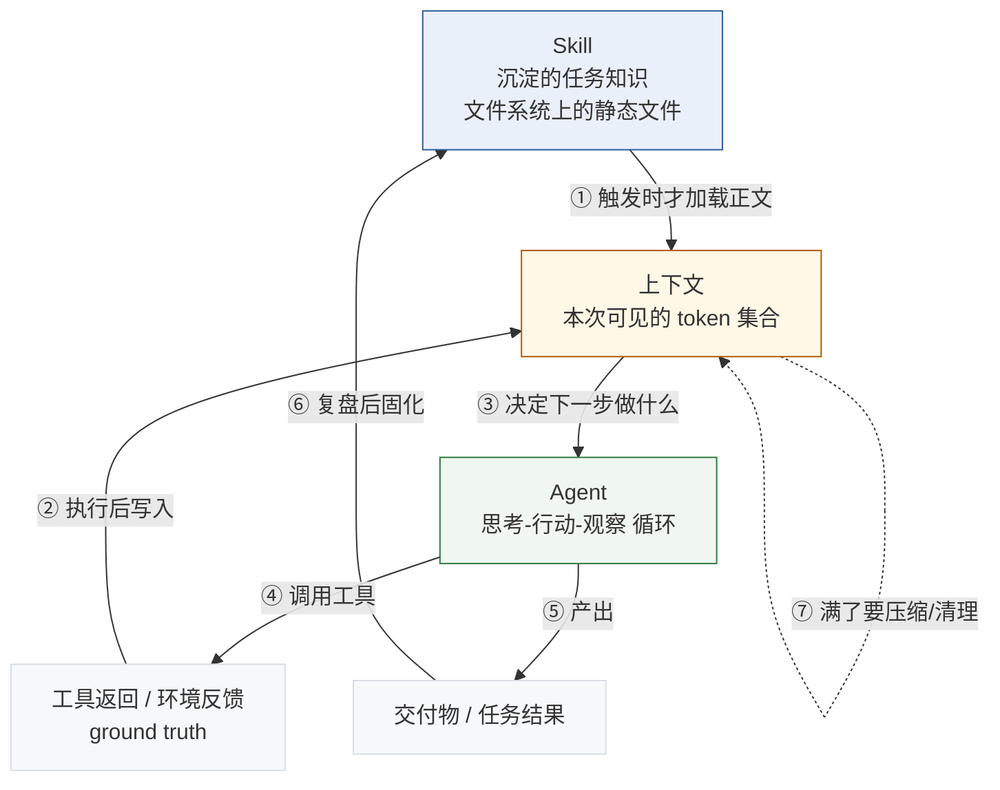

# 概念关系说明：Agent × 上下文 × Skill

> 配套资料：[Agent](./../learning-materials/agent.html) · [大模型的上下文](./../learning-materials/llm-context.html) · [Skill](./../learning-materials/skill.html)
> 作者：楼欣钰　｜　整理日期：2026-09-09

---

## 0. 一句话概括

**Agent 是干活的主体，上下文是它此刻能看到的全部信息，Skill 是它按需取用的经验手册。**
三者构成一个闭环：Skill 决定「什么知识在什么时刻进入上下文」，上下文决定「Agent 这一步能做出多好的判断」，Agent 的执行结果又反过来变成新的上下文，并最终沉淀为新的 Skill。

---

## 1. 三个概念各自回答的问题

| 概念 | 回答的问题 | 本质 | 存在形态 |
|---|---|---|---|
| **Agent** | 谁来把这件事做完？ | 一种**系统结构**：模型 + 工具 + 循环 + 反馈 | 运行时的执行循环 |
| **上下文** | 它此刻能看到什么？ | 一种**有限资源**：本次调用的输入 token 集合 | 每次 API 调用的输入 |
| **Skill** | 它凭什么做得专业？ | 一种**知识封装**：文件夹 + 元数据 + 指令 + 脚本 | 文件系统上的静态文件 |

关键观察：三者的**存在形态完全不同**——一个是运行时循环，一个是每次调用的输入，一个是磁盘上的文件。它们不是同一层面的东西，这也是很多人把它们混为一谈的原因。

---

## 2. 关系图



图中七条箭头的含义：

| 编号 | 关系 | 说明 |
|---|---|---|
| ① | **Skill → 上下文** | Skill 的元数据常驻上下文，正文只在被触发时才加载进来 |
| ② | **环境 → 上下文** | 工具返回的结果、报错、文件内容成为新的上下文 |
| ③ | **上下文 → Agent** | 上下文的质量直接决定 Agent 这一步的判断质量 |
| ④ | **Agent → 环境** | Agent 调用工具改变外部世界，并获得反馈 |
| ⑤ | **Agent → 交付物** | 循环结束后产出结果 |
| ⑥ | **交付物 → Skill** | 把这次成功的做法固化成 Skill，下次自动复用 |
| ⑦ | **上下文 → 上下文** | 上下文需要自我管理：压缩、清理、按需加载 |

---

## 3. 关系一：上下文如何影响 Agent 的工作

这是三个关系里最容易被低估的一条。**上下文不是 Agent 的背景板，而是它的能力边界。**

### 3.1 上下文决定 Agent 「知道什么」

Agent 没有独立于上下文的记忆。它每一步能依据的，只有当前上下文里摆着的东西：任务目标、已经做过什么、上一步工具返回了什么、有没有相关的领域知识。**上下文里没有的信息，对 Agent 而言等同于不存在。**

这意味着：给 Agent 换一个更长的窗口，不等于让它更聪明；但**给它在正确时刻塞进正确的信息，会让它的判断质量立刻提升**——这正是上下文工程的意义。

### 3.2 上下文决定 Agent 「注意什么」

由于 Transformer 的注意力机制存在 n² 压力，且存在 context rot（随 token 数增加，信息召回能力梯度式下降），**堆在上下文里的低信号内容会挤占高信号内容的注意力**。

对 Agent 的直接影响是：随着循环轮数增加，工具返回的原始结果不断累积，上下文越来越臃肿，模型反而容易忽略最初的任务目标和关键约束。这就是为什么长任务 Agent 必须做压缩和清理——**不是为了省 token，首先是为了不让 Agent 「失焦」。**

### 3.3 上下文决定 Agent 「能跑多久」

窗口一旦填满，请求直接失败，任务前功尽弃。所以上下文管理不是优化项，而是**长任务 Agent 能否跑完的先决条件**。Anthropic 归纳的四种手段各有分工：

| 手段 | 解决什么问题 | 对 Agent 的意义 |
|---|---|---|
| 按需加载（just-in-time） | 避免一开始就撑满 | 让 Agent 能启动，且上下文保持高信号 |
| 压缩（compaction） | 长度随轮次增长 | 让 Agent 能跑得久 |
| 外部笔记（memory / 结构化笔记） | 跨轮次、跨会话保留关键信息 | 让 Agent 能保持目标感，不半途忘掉初衷 |
| 子智能体（sub-agent） | 隔离探索过程的污染 | 让主 Agent 的上下文只留结论，专注综合判断 |

---

## 4. 关系二：Skill 如何沉淀可复用的任务知识

### 4.1 沉淀的是什么

Agent 有智力和工具，但缺**领域专长**——也就是「这件事的正确做法」。Skill 沉淀的正是这部分：工作流、最佳实践、模板、脚本，以及「什么情况下不该这么做」的边界判断。

值得注意的是，Skill 沉淀的不只是「怎么做」，还包括**「什么时候做」和「做到什么程度算合格」**。我自己的 concept-study-guide 里就同时写了这三层：适用场景（何时做）、生成步骤（怎么做）、自检清单（合格标准）。少了任何一层，复用时都会出问题。

### 4.2 沉淀的机制：渐进式披露

Skill 之所以能「沉淀大量知识又不拖累 Agent」，靠的是三级加载：

| 级别 | 内容 | 加载时机 | 上下文开销 |
|---|---|---|---|
| L1 元数据 | name + description | 始终 | 每个约 50–100 tokens |
| L2 指令正文 | SKILL.md 主体 | 匹配命中后 | 建议 < 5k tokens |
| L3 资源与代码 | 参考文档、脚本、模板 | 被引用时 | 脚本可执行、不必读入 |

**这是 Skill 与「把长指令写进项目说明文件」的根本区别**：项目说明文件常驻上下文，写多少就占多少；Skill 平时只占几十个 token 的元数据。所以一个 Agent 可以装备几百个 Skill 而不影响性能——**知识可以无限沉淀，代价却按需支付。**

### 4.3 沉淀的闭环

Skill 不是一次性产物，而是一个可以迭代的资产：

```
做任务 → 发现反复交代同样的要求 → 抽成 Skill → 用几次发现问题 → 改 SKILL.md → 提交 Git → 下次自动生效
```

Anthropic 甚至建议直接在工作中让 Claude 把自己成功的做法和被纠正的错误写进 Skill。我认为这条最有价值：**Skill 是 Agent 时代少数能让「经验」真正跨会话累积的机制**——因为上下文会清空，模型权重不会因为你改了个流程而改变，而 Skill 会。

---

## 5. 用本次作业走一遍这个闭环

把抽象关系落到我实际做的事情上：

| 阶段 | 发生了什么 | 对应概念 |
|---|---|---|
| 1. 建仓库 | 我在工作区创建 concept-learning-kit，git init | — |
| 2. 沉淀知识 | 把「怎么学一个概念」写成 `.workbuddy/skills/concept-study-guide/SKILL.md` | **Skill**（把方法固化成文件） |
| 3. 触发加载 | 我说「用 concept-study-guide 学 Agent」，模型读到 description 匹配成功，把 SKILL.md 正文读进上下文 | **Skill → 上下文**（关系①） |
| 4. 执行任务 | 模型按 SKILL.md 的步骤检索来源、搭骨架、生成 HTML；期间它用 WebSearch 找来源、用命令验证链接可访问 | **上下文 → Agent → 工具**（关系③④） |
| 5. 环境反馈 | 验证链接时返回 200/404，curl 报错「端口 22 被拒」，这些结果进入上下文，模型据此调整（改用 HTTPS） | **环境 → 上下文**（关系②） |
| 6. 产出与固化 | 三份 HTML 交付；同时把「来源必须验证」这条经验写进 Skill 的自检清单，提交 Git | **交付物 → Skill**（关系⑥） |

这个过程中最直观的一点：**同一个模型，因为上下文里多了一份 SKILL.md，产出的东西从「一段解释」变成了「一份结构完整、带来源、带自测题的学习资料」。**模型没变，变的是上下文；而让上下文变好的，是 Skill。

---

## 6. 我的判断

以下几点是我在整理过程中形成的、不完全来自资料的看法：

1. **「上下文工程」比「提示词工程」更接近 Agent 开发的核心。** 因为 Agent 的表现上限取决于它每一步看到什么，而不是某段提示词写得多漂亮。但要做好上下文工程，前提是知道哪些内容值得进来——而这恰恰是 Skill 提供的。所以我认为**Skill 是上下文工程的关键抓手**。

2. **三者的重要性排序会随任务复杂度变化。** 简单任务里，Skill 的作用最大（直接决定输出质量）；长任务里，上下文管理的重要性会迅速超过一切——跑不完的任务，方法再好也没用。所以我不认为存在「哪个概念更重要」的静态答案。

3. **Agent 和 Workflow 的二分法在实践中是模糊的。** 我在 Agent 资料里也写了这点。真实产品几乎都是混合体，这个划分更适合作为设计时的思考工具，而不是贴标签的分类标准。

4. **Skill 目前最大的短板是触发的不可控。** 它完全依赖 description 的语义匹配，开发者很难预判模型会不会调用。这让我觉得，未来的方向可能是更结构化的触发条件，而不只是靠一段自然语言描述。（这是我自己的推测，没有官方资料支持。）

---

## 7. 一句话记忆法

> **Agent 是工人，上下文是他的工作台，Skill 是书架上的手册。**
> 工作台大小有限，所以不能什么都往上堆；手册可以放几百本，因为只有需要时才抽出来翻；而工人干活的经验，最后又会写回手册里。
